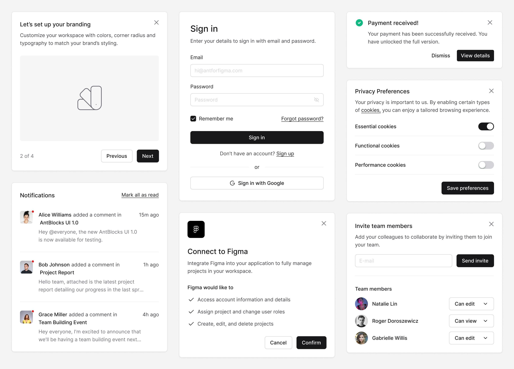

## Uitimate
The next generation of UI component library authoring.

A replacement for [shadcn/ui](https://github.com/shadcn-ui/ui) with significant improvements to greatly enhance DX ⎯ in terms of engineering best practices & new innovations ⎯ that one can feed into AI to further boost productivity.

Visit [https://ui-timate.web.app](https://ui-timate.web.app) for more details.

## License
[MIT](https://github.com/its-tim-lee/uitimate/blob/main/LICENSE.md)